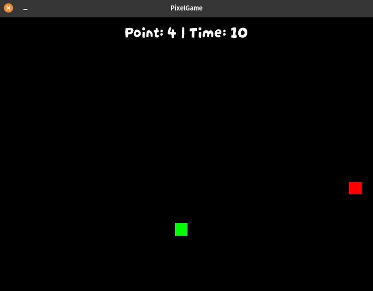

# PIXEL GAME - PYGAME

<p align="center">
    
</p>

#

O objetivo deste jogo é poder auxiliar os estudos em **algoritmo** e **lógica** de programação.

O jogo tem uma lógica simples e fácil de jogar. Onde o jogador tem **10 segundos** de tempo para poder comer as frutas que são adicionados aleatoriamente para o jogador, ao comer as frutas, o tempo aumenta para mais **2 segundos** e é adicionado **1 pontos** para o jogador. Quando o tempo chega a zero(0) é dado GameOver e o jogo finaliza.


## comando para rodar o jogo
```shell
python3 src/main.py
```